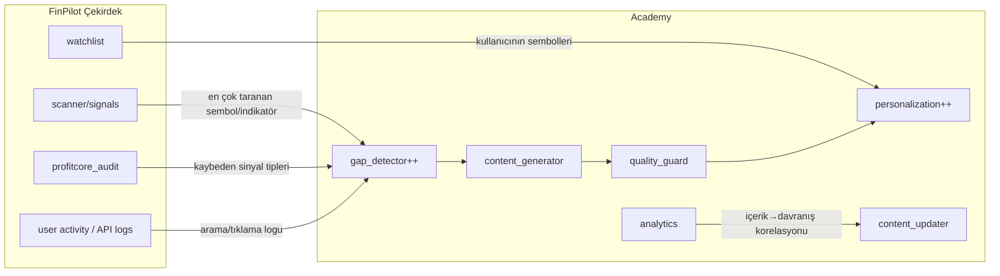

# FinPilot Academy — Self-Evolving (Kendini Geliştiren) Sistem Tasarımı

**Tarih:** 2026-06-11
**Kapsam:** Mevcut 6-ajan Academy sisteminin auditi + FinPilot çekirdek sinyalleriyle entegrasyon tasarımı + uygulama roadmap'i
**Not:** Bu belge **tasarımdır**; kod implementasyonu onay sonrası ayrı handoff ile yapılacaktır.

---

## 1. Mevcut Durum Auditi

### 1.1 Mimari
- **Konum:** `academy/` (paket) + `FinanceAcademy/` (standalone FastAPI app, :8001)
- **DB:** SQLite (`data/academy.db`, `academy_v2.db`) — 8 tablo
- **LLM:** Groq (içerik üretimi + kalite kontrol)
- **Orchestrator:** `academy/orchestrator.py` — daily/weekly/quarterly akış
- **Scheduler:** APScheduler (günlük 02:00, haftalık Pzt 07:00, 90-günlük review)

### 1.2 Mevcut 6 Ajan

| Ajan | Görev | Tetikleyici | Kendi-kendine? |
|------|-------|-------------|----------------|
| `gap_detector` | Eksik içerik tespiti (domain coverage, quiz hataları, arama kaçakları) | Günlük 02:00 | ⚠️ Kısmen (arama logu yoksa kör) |
| `content_generator` | LLM ile ders üretimi | Gap sinyali, manuel | ✅ |
| `quality_guard` | 7-boyutlu QA (APPROVED/REVISION/REJECTED) | Her yeni ders | ✅ |
| `personalization` | Kişisel öğrenme yolu | Kullanıcı aktivitesi | ✅ |
| `content_updater` | 90-günlük tazeleme + düşük puanlı güncelleme | Schedule + feedback | ✅ |
| `analytics` | Haftalık performans raporu | Pzt 07:00 | ✅ |

### 1.3 🔴 Temel Bulgu — İzolasyon
- Academy, FinPilot çekirdeğinden (scanner, DRL, signals, watchlist) **tamamen kopuk**.
- `gap_detector` "arama kaçaklarını" tarıyor ama arama logu altyapısı yok → **kör çalışıyor** (kod yorumunda da yazıyor).
- İçerik tamamen **genel finans eğitimi**; kullanıcının gerçekte taradığı/işlem yaptığı sembollere bağlı değil.
- `academy/` ve `FinanceAcademy/academy/` **çift kopya** → bakım riski.

### 1.4 "Self-evolving" değerlendirmesi
Mevcut sistem **içerik döngüsünde** kendini geliştiriyor (gap→üret→QA→yayınla→ölç→güncelle). Ancak **ürün sinyalinden öğrenmiyor**: gerçek kullanıcı davranışı, scanner sonuçları, kazanan/kaybeden sinyaller içeriğe geri beslenmiyor.

---

## 2. Hedef Mimari — FinPilot Sinyalleriyle Bağlı Academy



### Entegrasyon prensibi
Academy bir **veri tüketicisi** olur: FinPilot'un ürettiği sinyalleri "öğrenme ihtiyacı" sinyaline çevirir. Örnek: kullanıcı RSI tabanlı sinyalleri sürekli görmezden geliyorsa → "RSI yorumlama" dersi öner.

---

## 3. Entegrasyon Tasarımı (4 köprü)

### Köprü 1 — Arama/Aktivite Logu (gap_detector körlüğünü çöz)
- **Sorun:** `_scan_search_misses()` veri kaynağı yok.
- **Çözüm:** FinPilot API'ye hafif event log ekle (`api/routers/` → `academy_events` tablosu): kullanıcı arama terimleri, tıklanan sözlük terimleri, "bu ne demek?" tıklamaları.
- **Çıktı:** gap_detector gerçek kullanıcı boşluklarını görür.

### Köprü 2 — Scanner Sinyal → İçerik İhtiyacı
- **Veri:** En çok taranan semboller, en çok tetiklenen indikatörler (scanner çıktısından).
- **Çözüm:** `gap_detector`'a `_scan_signal_patterns()` ekle → "bu hafta momentum sinyali çok, momentum dersi güncel mi?" kontrolü.

### Köprü 3 — profitcore → Davranışsal Ders
- **Veri:** [WIN_RATE_ANALIZI.md](../audits/2026-06-11/WIN_RATE_ANALIZI.md) — kullanıcıların kaybettiği sinyal tipleri.
- **Çözüm:** Kaybeden pattern'ler için "risk yönetimi / aşırı-güven biası" derslerini öne çıkar (behavioral-finance domaini zaten var).
- **Etik kapı:** Edge kanıtlanmadığı için içerik "şu sinyale güven" değil, "neden dikkatli olmalısın" tonunda olmalı.

### Köprü 4 — Watchlist → Kişiselleştirme
- **Veri:** Kullanıcının watchlist sembolleri + sektörleri.
- **Çözüm:** `personalization` ajanına sektör-farkındalıklı ders önerisi: "Portföyün %60 teknoloji → konsantrasyon riski dersi."

---

## 4. Self-Evolving Döngü (genişletilmiş)

```
1. GÖZLEM   → scanner sinyalleri + kullanıcı aktivitesi + profitcore sonuçları
2. TESPİT   → gap_detector: hangi konuda boşluk/yanlış anlama var?
3. ÜRETİM   → content_generator: LLM ile ders + quiz + örnek (gerçek sembollerle)
4. KALİTE   → quality_guard: 7-boyut QA, finansal doğruluk + etik ton
5. SUNUM    → personalization: kullanıcının portföyüne göre sırala
6. ÖLÇÜM    → analytics: ders→davranış değişimi (kullanıcı daha mı disiplinli?)
7. ÖĞRENME  → content_updater: işe yaramayan dersi revize et, döngü başa
```

**Yeni metrik:** "İçerik etkisi" — bir dersi tamamlayan kullanıcının sonraki sinyal davranışı değişti mi? (örn. stop-loss kullanımı arttı mı). Bu, Academy'yi gerçek "self-evolving" yapan kapanış halkasıdır.

---

## 5. Uygulama Roadmap'i (öncelik sırası)

| # | İş | Bağımlılık | Öncelik | Çıktı |
|---|-----|-----------|---------|-------|
| 1 | `academy/` ↔ `FinanceAcademy/academy/` çift kopyayı birleştir | — | 🔴 P0 | Tek kaynak |
| 2 | `academy_events` tablosu + API event log (Köprü 1) | api/ | 🔴 P0 | Arama/aktivite logu |
| 3 | `gap_detector._scan_search_misses()` gerçek loga bağla | #2 | 🟠 P1 | Körlük çözülür |
| 4 | `_scan_signal_patterns()` (Köprü 2) | scanner çıktısı | 🟠 P1 | Sinyal-farkındalıklı içerik |
| 5 | `personalization` watchlist entegrasyonu (Köprü 4) | auth/portfolio | 🟡 P2 | Sektör-farkındalıklı öneri |
| 6 | "İçerik etkisi" metriği (Köprü 3 + analytics) | profitcore | 🟡 P2 | Kapanış halkası |
| 7 | Frontend finsense → canlı Academy API bağlantısı | hepsi | 🟡 P2 | Statik→dinamik |

---

## 6. Riskler ve Etik Kapılar

1. **Yatırım tavsiyesi sınırı:** Academy eğitim verir, sinyal/tavsiye vermez. Edge kanıtlanmadığı için "kazandıran strateji" dili **yasak**.
2. **LLM halüsinasyon:** quality_guard finansal doğruluk boyutu sıkı tutulmalı; sayısal iddialar kaynak gerektirmeli.
3. **Veri gizliliği:** Kullanıcı watchlist/aktivite verisi kişiselleştirme için kullanılırken KVKK/GDPR uyumu (anonimleştirme, opt-in).
4. **Çift kopya riski:** #1 yapılmadan diğer entegrasyonlar iki yerde bakım gerektirir.

---

## 7. Sonuç

Mevcut Academy **içerik üretiminde** olgun ve gerçekten kendini güncelleyen bir sistem. Eksik olan, **FinPilot ürün sinyalleriyle bağ**. 4 köprü (event log, scanner patterns, profitcore, watchlist) kurulduğunda Academy:
- Kullanıcının gerçek davranışından öğrenir,
- İçeriği gerçek portföye göre kişiselleştirir,
- Ve "içerik etkisi" metriğiyle kendi etkinliğini ölçer.

Bu, Academy'yi izole bir eğitim silosundan **ürünün retention ve davranış-değiştirme motoruna** dönüştürür.

---
*FinPilot Academy Tasarımı — 2026-06-11*
